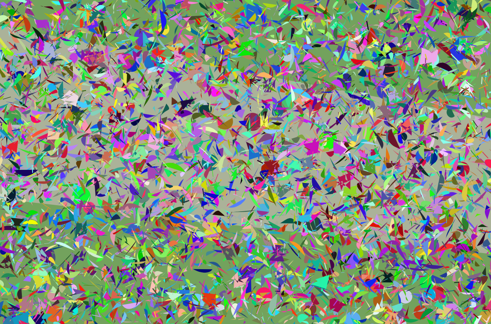
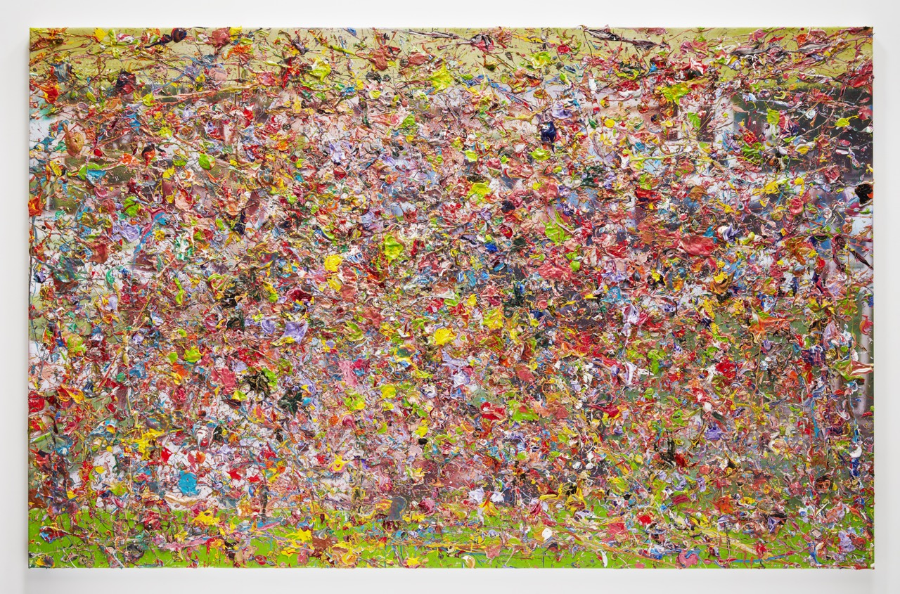
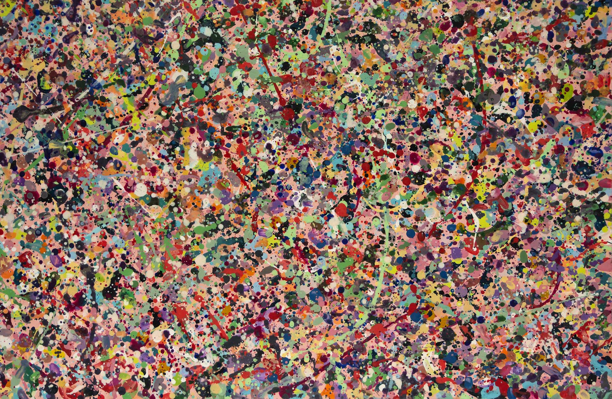

# VVG - A Random Painter

Generative art library that creates abstract paintings using the Canvas API. Works in Node.js and the browser.



## Installation

```bash
npm install @tiveor/vvg
```

Node.js requires the [`canvas`](https://github.com/Automattic/node-canvas) package as a dependency.

## Quick Start

### Node.js

```typescript
import { VVG, example4 } from "@tiveor/vvg";
import { createCanvas } from "canvas";

const canvas = createCanvas(1024, 768);
const painter = new VVG(canvas);

// Use a built-in example
example4(painter);

// Save to file
await painter.saveToFile("painting.png");
```

### Browser

```html
<canvas id="painting" width="1024" height="768"></canvas>
<script src="dist/index.global.js"></script>
<script>
  const canvas = document.getElementById("painting");
  const painter = new VVG.VVG(canvas);
  VVG.example4(painter);
</script>
```

### ES Module in Browser

```html
<canvas id="painting" width="1024" height="768"></canvas>
<script type="module">
  import { VVG, example4 } from "./dist/index.js";

  const canvas = document.getElementById("painting");
  const painter = new VVG(canvas);
  example4(painter);
</script>
```

## API

### Drawing Methods

All drawing methods receive a typed options object:

```typescript
const painter = new VVG(canvas);

// Frame with borders and author label
painter.drawFrame({ width, height, borderUp, borderRight, borderDown, borderLeft, color, colorBorder, author? });

// Basic shapes
painter.drawDot({ x, y, size, color });
painter.drawLine({ points: [from, to], width, color });
painter.drawEllipse({ x, y, size, color });
painter.drawPolygon({ points: [...], color });
painter.drawQuadrilateral({ points: [p1, p2, p3, p4], color });
painter.drawBezier({ points: [start, cp1, cp2, end], color });

// Extended shapes
painter.drawStar({ cx, cy, spikes, outerRadius, innerRadius, color });
painter.drawLabel({ x, y, text, font, color });
painter.drawBackground({ p1, p2, p3, p4, limit, type: BackgroundType.HORIZONTAL, color });
painter.drawImage({ x, y, width, height, src });

// Animated tree (async)
painter.drawTree({ trunks, width, height, color, shadowColor }, onFinished);
painter.drawGrass();

// Save to PNG (Node.js only)
await painter.saveToFile("output.png");
```

### Utilities

```typescript
import { Randomizer, generate, Colorizer, PaletteType } from "@tiveor/vvg";

// Random numbers
Randomizer.random(0, 100);       // float between 0-100
Randomizer.randomInt(1, 10);     // integer between 1-10
Randomizer.randomBool();         // true or false

// Bounded randomizer
const r = new Randomizer(minX, minY, maxX, maxY);
r.randInsideX();                 // random X within bounds
r.randInsideY();                 // random Y within bounds

// Color palettes
const c = new Colorizer(PaletteType.PALETTE_BOLIVIA);
c.rand();                        // random color from palette
Colorizer.randColor();           // random RGB color
Colorizer.randColorAlpha();      // random RGBA color

// Repeat execution
generate(10, 50, () => {         // execute 10-50 times
  painter.drawDot({ ... });
});
```

### Available Palettes

| Palette | Description |
|---------|-------------|
| `PALETTE_1` | Earthy tones |
| `PALETTE_2` | Vivid colors |
| `PALETTE_FABER` | Faber-Castell artist colors |
| `PALETTE_BOLIVIA` | Bolivian flag colors |
| `PALETTE_WHIPALA` | Whipala indigenous flag colors |

### Built-in Examples

| Function | Name | Description |
|----------|------|-------------|
| `example1(vvg)` | Free Drawing | Showcase of all shape types |
| `example2(vvg)` | Bolivian Party | Ellipses and stars with Bolivian palette |
| `example3(vvg, callback)` | Jacaranda | Animated tree with leaves (async) |
| `example4(vvg)` | Aviary | Complex composition with all shapes |

## Development

```bash
npm run build    # Build ESM + CJS + IIFE + types
npm run dev      # Watch mode
npm test         # Generate example painting
```

## Project Structure

```
src/
├── index.ts              # Main VVG class + re-exports
├── types.ts              # TypeScript interfaces
├── shapes/               # Basic shapes (Dot, Line, Ellipse, Polygon, etc.)
├── extended/             # Complex shapes (Frame, Star, Tree, Snake, etc.)
├── utils/                # Randomizer, Colorizer, Palettes
└── examples/             # Built-in example compositions
```

## Inspiration


**Marc Quinn** - [Chaos Paintings](http://marcquinn.com/artworks/chaos-paintings)


**Bert Ernie** - [The Most Beautiful Man That Ever Lived](https://berternie.com)

## License

MIT - Alvaro Orellana
